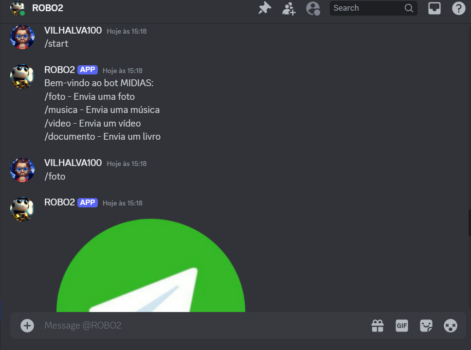
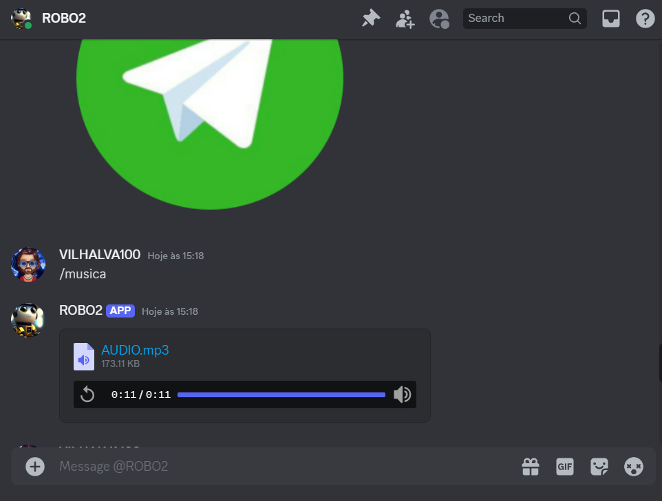
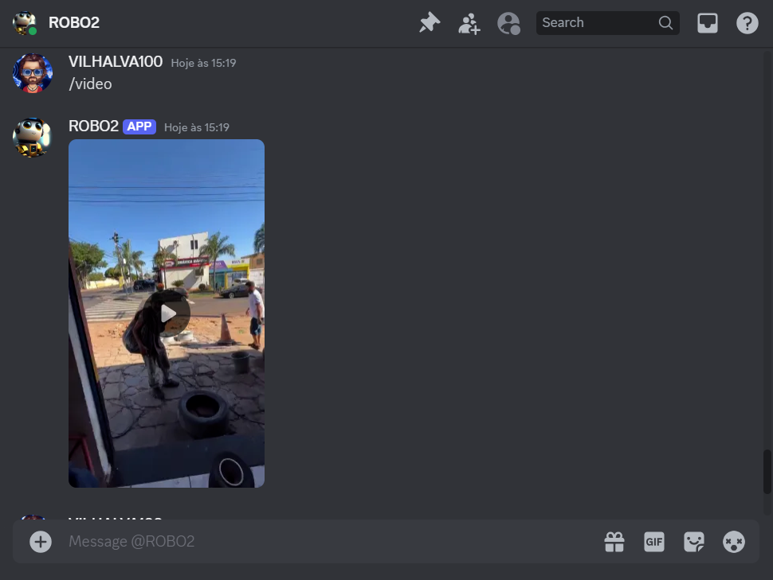
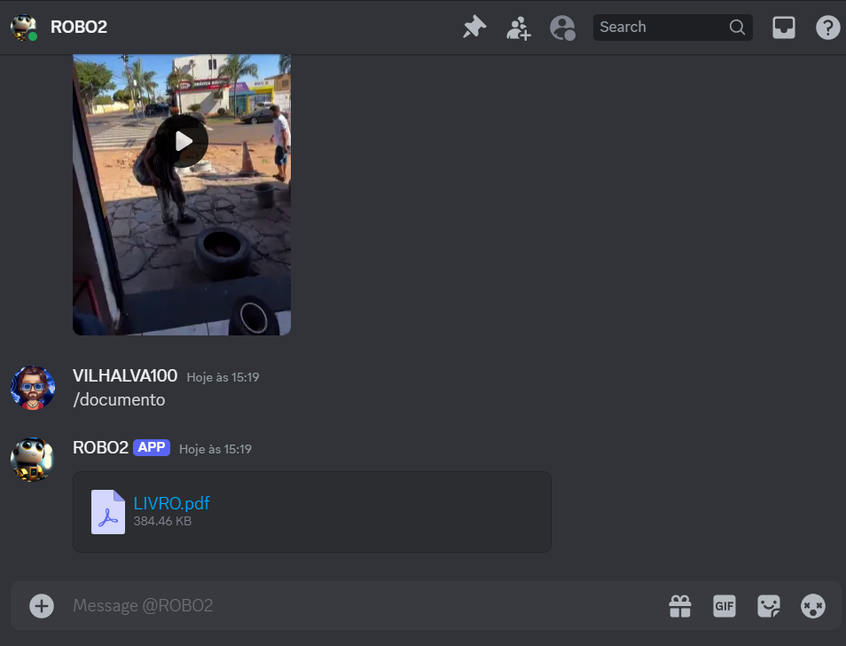

# MIDIAS COM DISCORDPY
🤖ESTE É UM BOT FEITO COM DISCORDPY. ELE É PROJETADO PARA ENVIAR DIFERENTES TIPOS DE MÍDIA EM RESPOSTA A COMANDOS ESPECÍFICOS NO DISCORD.

 <br>
 <br>
 <br>
 <br>

## DESCRIÇÃO:
O bot desenvolvido em Discord.py é projetado para enviar diferentes tipos de mídia em resposta a comandos específicos no Discord. Ele é configurado para responder aos comandos `/foto`, `/musica`, `/video`, e `/documento`, enviando arquivos de imagem, áudio, vídeo e documento, respectivamente.

## FUNCIONALIDADES:
1. **Comando `/start`**
   - Ao enviar o comando `/start`, o bot responde com uma mensagem de boas-vindas e lista os comandos disponíveis:
     ```
     Bem-vindo ao bot MIDIAS:
     /foto - Envia uma foto
     /musica - Envia uma música
     /video - Envia um vídeo
     /documento - Envia um livro
     ```

2. **Comandos Específicos**
   - **`/foto`**: Envia um arquivo de imagem (`FOTO.png`) para o canal onde o comando foi utilizado.
   - **`/musica`**: Envia um arquivo de áudio (`AUDIO.mp3`) para o canal onde o comando foi utilizado.
   - **`/video`**: Envia um arquivo de vídeo (`VIDEO.mp4`) para o canal onde o comando foi utilizado.
   - **`/documento`**: Envia um arquivo de documento (`LIVRO.pdf`) para o canal onde o comando foi utilizado.

3. **Tratamento de Erros**
   - Cada comando de envio de mídia inclui um tratamento de exceção para lidar com possíveis erros durante o envio do arquivo. Se ocorrer algum problema ao enviar a mídia, o bot enviará uma mensagem de erro para o canal.

## EXECUTANDO O PROJETO:
1. **Editar o código:**
   - Substitua `seu_token_aqui` pelas suas credenciais corretas, que podem ser obtidas no [Discord Developer Portal](https://discord.com/developers/applications), em `CODIGO/TOKEN.py`.

2. **Instalando as dependências:**
   - Antes de executar o aplicativo, certifique-se de instalar todas as dependências necessárias. No terminal, execute o seguinte comando para instalar as dependências listadas no arquivo `requirements.txt` no diretório: `CODIGO`:
   ```bash
   pip install -r requirements.txt
   ```
   - Isso instruirá o pip a ler o arquivo requirements.txt e instalar todas as dependências listadas.

3. **Inicie o Bot:**
   - Execute o bot do Discord iniciando-o com o seguinte comando no diretório `CODIGO`:
    ```bash
    python CODIGO.py
    ```

4. **Interagindo com o Bot:**
   - No Discord, adicione o bot ao seu servidor e certifique-se de que ele esteja online.
   - Use os seguintes comandos para interagir com o bot:
     - `/start`: Para receber as boas-vindas e ver a lista de comandos disponíveis.
     - `/foto`: Para receber e visualizar a foto enviada pelo bot.
     - `/musica`: Para ouvir a música enviada pelo bot.
     - `/video`: Para assistir ao vídeo enviado pelo bot.
     - `/documento`: Para baixar e visualizar o documento enviado pelo bot.

5. **Observações:**
   - O bot responderá aos comandos apenas nos canais onde ele tem permissão para enviar mensagens.
   - Certifique-se de que o bot tenha acesso aos arquivos de mídia e ao diretório onde estão localizados.

## NÃO SABE?
- Entendemos que para manipular arquivos em muitas linguagens e tecnologias relacionadas, é necessário possuir conhecimento nessas áreas. Para auxiliar nesse aprendizado, oferecemos cursos gratuitos disponíveis:
* [CURSO DE DISCORDPY](https://github.com/VILHALVA/CURSO-DE-DISCORDPY)
* [CURSO DE PYTHON](https://github.com/VILHALVA/CURSO-DE-PYTHON)
* [CONFIRA MAIS CURSOS](https://github.com/VILHALVA?tab=repositories&q=+topic:CURSO)

## CREDITOS:
- [PROJETO BASEADO NO "MIDIAS COM TELEGRAF"](https://github.com/VILHALVA/MIDIAS-COM-TELEGRAF)
- [PROJETO FEITO PELO VILHALVA](https://github.com/VILHALVA)

